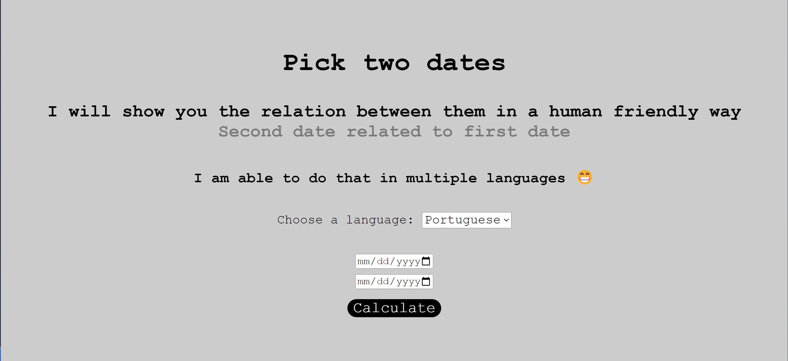
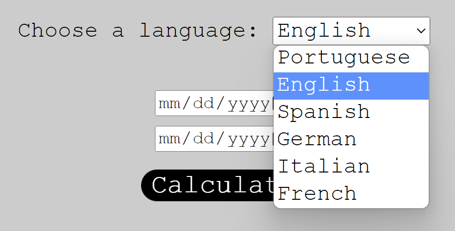
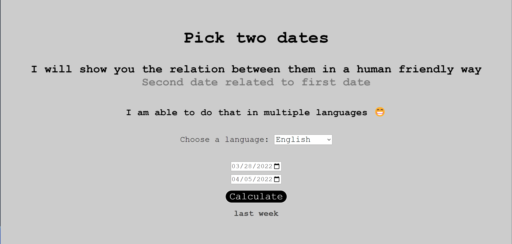

# Human Readable Duration

Duration in a way that humans can read and understand 🕐



You can choose multiple languages 👇



And then, check the result



# Technologies

- [JavaScript](https://developer.mozilla.org/en-US/docs/Web/JavaScript)
- [Node](https://nodejs.org/en/docs/)

# Setup

## Clone repository

Create and go to the directory where you want to place the repository

```bash
  cd my-directory
```

Clone the project

```bash
  git clone https://github.com/pncsoares/human-readable-duration.git
```

Go to the project directory

```bash
  cd human-readable-duration
```

# License

MIT